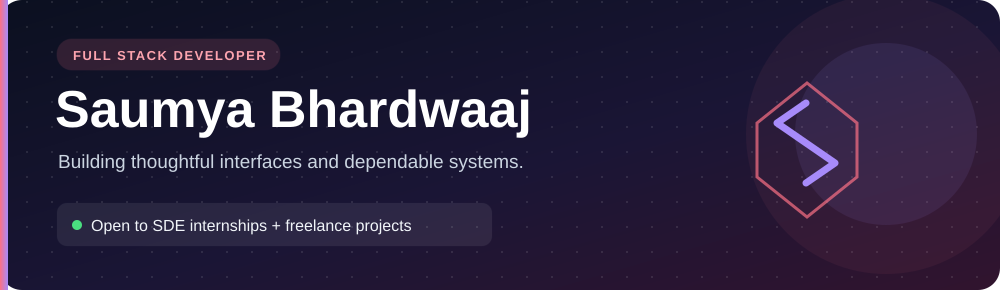
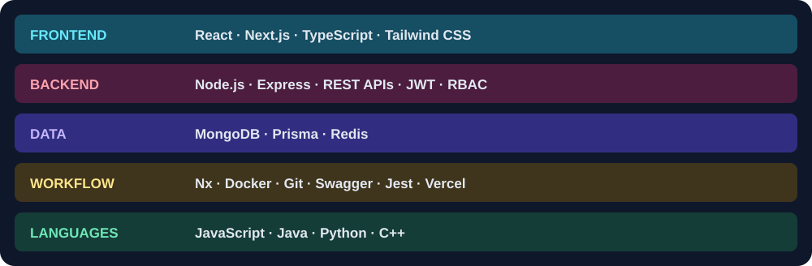

**B.Tech student at Haldia Institute of Technology** · Building across frontend, backend, and deployment.

  

---

## A little about me

I enjoy turning complex workflows into clear interfaces and dependable APIs. My current work spans an e-commerce platform with customer, seller, and admin experiences, and a location-aware heat-risk dashboard. For a closer look at my work and background, visit **[my portfolio](https://sam-b-codes-portfolio.vercel.app/)**.

## What I work with

<b>See how I use this stack in my projects</b>

- **ESHOP:** Next.js interfaces, Express services, JWT-based authentication, MongoDB with Prisma, Redis, and an Nx monorepo.
- **HeatShield India:** responsive dashboard UI, searchable state and district selection, maps, and backend API integration.
- **Exploring next:** event-driven communication with Kafka and more robust deployment workflows.

## Featured work

### ESHOP · E-commerce platform

**A full-stack system with three distinct experiences:** customer shopping, seller management, and admin operations. I structured the backend into services for authentication, products, coupons, orders, and payments behind an API gateway, with role-aware access. Kafka-based features remain an area of ongoing work.

`Next.js` `TypeScript` `Express` `Nx` `MongoDB` `Prisma` `Redis`

 

---

### HeatShield India · Heat-risk dashboard

**A location-aware dashboard prototype for India.** I developed the responsive frontend with searchable state and district selection, map views, backend API integration, and clear handling of unavailable data.

`Next.js` `TypeScript` `Tailwind CSS` `Maps`

---

### Personal portfolio · My work, presented interactively

**A responsive portfolio designed around exploration.** Visitors can browse dedicated project pages, use an interactive terminal, and reach me through a contact form. It also includes an owner-facing content area.

`Next.js` `TypeScript` `Tailwind CSS`

 

---

### OrangeFork · Food ordering & reservations

**A customer-facing food experience** with ordering and table reservation flows, reusable React components, and client-side navigation.

`React` `Context API` `React Router`

## Beyond the screen

I am a member of the **PR & Management team at THE HIT TIMES**. I also placed second at the state level in swimming and qualified for nationals.

---

**Have an SDE opportunity or a freelance project?** [Get in touch](mailto:bhardwaajsaumya05@gmail.com) or [see more of my work](https://sam-b-codes-portfolio.vercel.app/).
